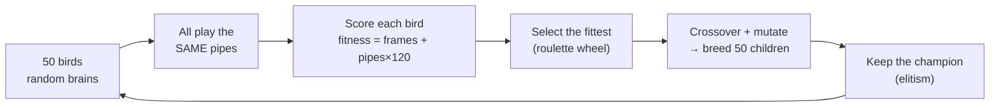

<h1 align="center">🐤 Flappy Bird AI — Neuroevolution in the Browser</h1>

<p align="center">
  <b>A flock of 50 neural-network birds teaches <i>itself</i> to play Flappy Bird — live, in your browser, with zero human rules.</b>
</p>

<p align="center">
  
  
  
  
</p>

---

## ✨ What is this?

This is a self-contained web app where an AI **learns Flappy Bird from scratch through artificial evolution** — the same principle that shaped life on Earth, running in a `<canvas>`.

Nobody programs the bird with rules like *"if a pipe is close, flap."* Instead:

1. We spawn **50 birds**, each driven by its own tiny **neural network** (a little artificial brain) wired completely at random — so at first, they all flap stupidly and crash.
2. We score how far each bird got (its **fitness**), breed the best ones together (mixing their brains + adding small random mutations), and produce 50 fresh birds for the next **generation**.
3. Repeat. Good "brain wiring" survives, bad wiring dies out, and within **~15 generations the birds clear hundreds of pipes.**

This technique is called **neuroevolution** = *neural networks* + *genetic algorithms*. You literally **watch evolution happen**, generation by generation.

> 📸 **Demo:** drop a `demo.gif` / `screenshot.png` into the repo and embed it here — e.g. ``

---

## 🧬 How it learns (the evolution loop)



Each bird's brain is a `[5 → 6 → 2]` neural network:
- **5 inputs** — the bird's height, velocity, distance to the next pipe, and the gap above/below it.
- **6 hidden neurons** — the "thinking" in between (with `tanh` activation).
- **2 outputs** — scores for *don't flap* vs *flap*; the bigger one wins.

No gradients, no backpropagation, no training data — just **play, score, breed, repeat.**

---

## 🎮 Features

- 🐤 **The whole flock at once** — all 50 birds fly simultaneously and thin out as they crash.
- 🧠 **Live "what the bird sees"** — the lead bird shows its inputs and a sensor line to the gap.
- 📈 **Learning-curve graph** — best fitness per generation, so you *see* it getting smarter.
- ⏩ **Fast-forward (1×–100×)** — speed through dozens of generations in seconds.
- 🎨 **Authentic sprites** — real Flappy Bird art (yellow/blue/red birds, animated wings, classic pipes & ground).
- 🪶 **Zero dependencies, zero build** — pure HTML/CSS/JavaScript. Just open the file.

---

## 🚀 Run it

**Option 1 — instant:** download/clone and double-click **`index.html`**. That's it.

**Option 2 — local server** (recommended so all assets load cleanly):

```bash
git clone https://github.com/aminemanai2003/Flappy_Ai.git
cd Flappy_Ai
python -m http.server 8000
# open http://localhost:8000
```

No `npm install`. No bundler. No backend.

---

## 🗂️ Project structure

```
Flappy_Ai/
├── index.html              # page layout (canvas + sidebar + controls)
├── style.css               # styling / responsive two-column layout
├── PROJECT_EXPLAINED.md    # 📖 full A→Z deep dive — every concept explained
├── sprites/                # real Flappy Bird images
├── audio/                  # real Flappy Bird sounds
└── src/
    ├── game.js             # physics engine (gravity, pipes, collisions, scoring)
    ├── nn.js               # the neural network (a bird's brain)
    ├── ga.js               # the genetic algorithm (evolution)
    ├── render.js           # draws everything with the sprites
    ├── graph.js            # the learning-curve line chart
    └── main.js             # game loop + controls
```

Each file does exactly one job — physics doesn't know about drawing, the brain doesn't know it's playing Flappy Bird, evolution doesn't know what's inside a brain.

---

## 📖 Learn how it works

Want the full story? **[`PROJECT_EXPLAINED.md`](PROJECT_EXPLAINED.md)** is a complete, beginner-friendly A→Z guide that explains **every term and concept** used here — neural networks, weights, biases, activation functions, fitness, selection, crossover, mutation, elitism, the game loop, and more — plus a full glossary.

---

## 🔧 Tweak it

| Want to… | Change | In |
|----------|--------|----|
| Bigger/smaller flock | `popSize` (default `50`) | `src/ga.js` |
| More/less randomness | `mutationRate` (`0.15`) | `src/ga.js` |
| Smarter brains | `ARCH` → e.g. `[5, 8, 2]` | `src/ga.js` |
| Harder/easier game | `PIPE_GAP`, `GRAVITY`, `PIPE_SPEED` | `src/game.js` |
| Reward different behavior | the `fitness` formula | `src/ga.js` |

---

## 📊 Results

Out of the box, in testing:

- **Gen 1–3:** chaos — birds flap randomly and die fast.
- **A breakthrough generation:** one brain "gets it," and elitism + breeding spread the skill.
- **By ~Gen 17:** the best bird cleared **339 pipes** (fitness 71,324) and the learning curve goes vertical.

---

## 🙏 Credits & License

- **Code:** MIT © [aminemanai2003](https://github.com/aminemanai2003). See [`LICENSE`](LICENSE).
- **Sprites & audio:** the classic Flappy Bird asset pack by [samuelcust/flappy-bird-assets](https://github.com/samuelcust/flappy-bird-assets).
- Flappy Bird was originally created by **dotGears (Dong Nguyen)**. This is a **non-commercial, educational fan project** for demonstrating neuroevolution — not affiliated with or endorsed by the original creators.

---

<p align="center"><i>Nobody taught the bird to play. It evolved the ability — and you get to watch it happen. 🧬🐤</i></p>
